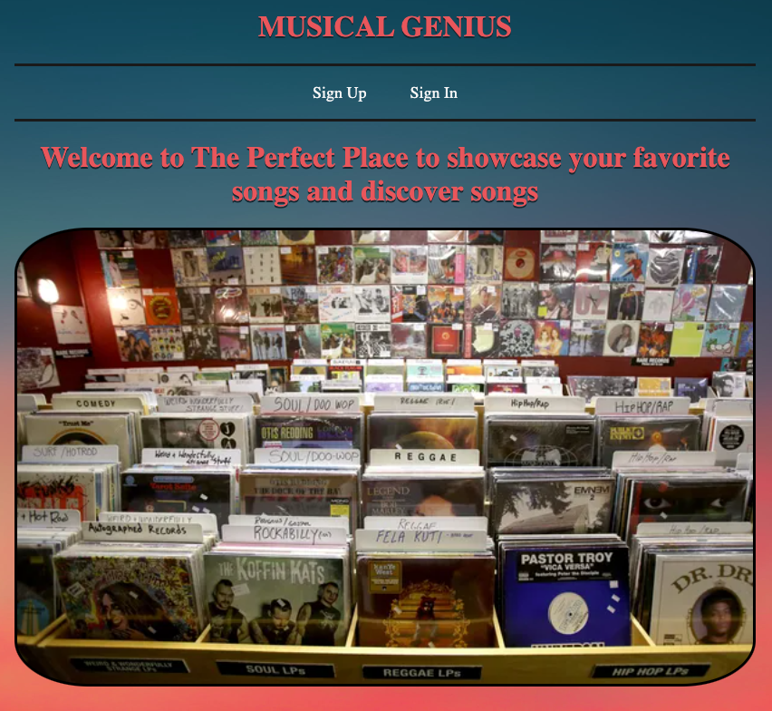

# Musical Genius

## [ACCESS](https://musical-genius-6e3865f8758c.herokuapp.com/) Musical Genius:

Create an account on Musical Genius to build a library of your favorite songs. It's the perfect place to discover new music based on various criteria, such as numbered ranks assigned to songs, moods associated with them, and exploring other users' libraries.

 **Expand Your Library, Inspire Others!**

 * [Trello Board](https://trello.com/b/421KS9Ll/unit-2-project) (Planning Materials)

 ## Why Musical Genius:
 Music is a massive passion of mine. Different songs can bring different emotions and memories. They are a way to express your personality. One of the greatest feelings is showing a friend a song they have not heard before and having them relate to it in their own way. This brings that experience to another level.

## Attributions

* [NightSky](https://c02.purpledshub.com/uploads/sites/48/2019/02/HyadesY16JanD07-2dc9bb4.jpg?webp=1&w=1200)
* [Records Photo](https://www.statesmanjournal.com/gcdn/-mm-/2c35efd35543717726985b963b5dfbe3761ef0f1/c=0-225-2996-1918/local/-/media/Salem/2015/04/14/B9316751043Z.1_20150414142559_000_GINAFBAK7.1-0.jpg?width=660&height=373&fit=crop&format=pjpg&auto=webp)
* [MusicNote Favicon](https://www.stickpng.com/img/miscellaneous/music-symbols/musical-note-eighth-note)

## Technology Implemented:

## Stretch Goals:

* Add a friends (Entourage) feature where you can add users to your group and personally recommend them songs
* You can add a song directly from the song show view
* You can sort songs according to artist, mood, or rank
* Duplicates of songs dont show up in index view